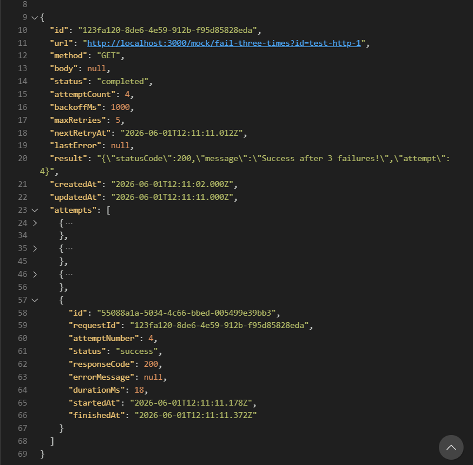

# Retry Engine

A production-inspired HTTP service that retries failed external requests with **exponential backoff + jitter**. Built with NestJS, TypeORM, and SQLite.

> Why? When your service calls a payment gateway or SMS provider, failures happen. Retry too fast and you make things worse. Don't retry at all and you lose work. This service implements the gold standard: exponential backoff with jitter, 4xx vs 5xx discrimination, and dead-letter tracking.

---

## 1. Quick Start

### Prerequisites

- Node.js 18+
- pnpm (recommended) or npm

### Installation

```bash
# Clone the repo
git clone https://github.com/Ekojoecovenant/retry-engine.git
cd retry-engine

# Install dependencies
pnpm install

# Start the server (development)
pnpm run start:dev

# Or production build
pnpm run build
pnpm run start:prod
```

The server runs on `http://localhost:3000`.

---

## 2. API Endpoints

### `POST /requests`

Create a new retryable request. Returns immediately with an ID — the background worker handles the actual HTTP call.

```bash
curl -X POST http://localhost:3000/requests \
  -H "Content-Type: application/json" \
  -d '{
    "url": "https://api.example.com/payment",
    "method": "POST",
    "body": "{\"amount\":100}",
    "maxRetries": 5,
    "backoffMs": 1000
  }'
```

**Response:**

```json
{
  "id": "550e8400-e29b-41d4-a716-446655440000",
  "status": "pending"
}
```

| Field | Default | Description |
| ----- | ------- | ----------- |
| `url` | required | The endpoint to call |
| `method` | `GET` | HTTP method (GET, POST, PUT, PATCH, DELETE) |
| `body` | `null` | Request body (stringified JSON) |
| `maxRetries` | `5` | Maximum attempts before dead-letter |
| `backoffMs` | `1000` | Base delay in milliseconds (doubles each retry) |

### `GET /requests/:id`

Get full request details + attempt history.

```bash
curl http://localhost:3000/requests/550e8400-e29b-41d4-a716-446655440000
```

**Response (completed request):**

```json
{
  "id": "...",
  "url": "http://localhost:3000/mock/fail-three-times",
  "status": "completed",
  "attemptCount": 4,
  "result": "{\"message\":\"Success\"}",
  "attempts": [
    { "attemptNumber": 1, "status": "failed", "responseCode": 500 },
    { "attemptNumber": 2, "status": "failed", "responseCode": 500 },
    { "attemptNumber": 3, "status": "failed", "responseCode": 500 },
    { "attemptNumber": 4, "status": "success", "responseCode": 200 }
  ]
}
```

### `GET /requests?status=<status>`

Filter requests by status: `pending`, `retrying`, `completed`, `failed`.

```bash
curl http://localhost:3000/requests?status=failed
```

---

## 3. Testing with Built-in Mock Endpoints

The service includes mock endpoints for testing retry behavior:

| Endpoint | Behavior |
| -------- | -------- |
| `GET /mock/fail-three-times?id=<unique>` | Fails 3 times (500), succeeds on 4th |
| `GET /mock/always-400` | Always returns 400 — tests 4xx no-retry |
| `GET /mock/always-500` | Always returns 500 — tests dead-letter |
| `POST /mock/reset` | Resets all mock counters |

**Test a successful retry sequence:**

```bash
# 1. Reset mock counters
curl -X POST http://localhost:3000/mock/reset

# 2. Create a retry request
curl -X POST http://localhost:3000/requests \
  -H "Content-Type: application/json" \
  -d '{
    "url": "http://localhost:3000/mock/fail-three-times?id=test-run-1",
    "method": "GET",
    "maxRetries": 5,
    "backoffMs": 1000
  }'

# 3. Wait ~5 seconds, then check status
curl http://localhost:3000/requests/<id>
```

---

## 4. Architecture Diagram

```plain
┌─────────────────────────────────────────────────────────────────┐
│                         POST /requests                          │
└─────────────────────────────────────────────────────────────────┘
                              │
                              ▼
┌─────────────────────────────────────────────────────────────────┐
│                      API Controller                             │
│  - Generate UUID                                                │
│  - Save to SQLite with status="pending", nextRetryAt = now()    │
│  - Return { id, status: "pending" } IMMEDIATELY                 │
└─────────────────────────────────────────────────────────────────┘
                              │
                              ▼
┌─────────────────────────────────────────────────────────────────┐
│                        SQLite Database                          │
│  ┌─────────────────────┐    ┌──────────────────────────────┐    │
│  │ requests table      │    │ attempts table               │    │
│  │ - id (UUID)         │◄───│ - requestId (FK)             │    │
│  │ - url, method, body │    │ - attemptNumber              │    │
│  │ - status            │    │ - status, responseCode       │    │
│  │ - attemptCount      │    │ - errorMessage, durationMs   │    │
│  │ - nextRetryAt       │    │ - startedAt, finishedAt      │    │
│  │ - lastError, result │    └──────────────────────────────┘    │
│  └─────────────────────┘                                        │
└─────────────────────────────────────────────────────────────────┘
                             │
                             ▼
┌─────────────────────────────────────────────────────────────────┐
│              Background Worker (@Interval(500ms))               │
│  SELECT * FROM requests WHERE nextRetryAt <= NOW()              │
│  AND status IN ('pending', 'retrying')                          │
└─────────────────────────────────────────────────────────────────┘
                              │
              ┌───────────────┼───────────────┐
              ▼               ▼               ▼
      ┌─────────────┐  ┌─────────────┐  ┌─────────────┐
      │ Attempt 1   │  │ Attempt 2   │  │ Attempt N   │
      │ 1s + jitter │  │ 2s + jitter │  │ 4s/8s/16s   │
      └─────────────┘  └─────────────┘  └─────────────┘
                              │
                              ▼
      ┌─────────────────────────────────────────────────┐
      │              External API Call                  │
      │  Success (2xx) → status="completed"             │
      │  4xx Error     → status="failed" (NO RETRY)     │
      │  5xx/Timeout   → nextRetryAt with backoff+jitter│
      │  maxRetries hit → status="failed" (DEAD-LETTER) │
      └─────────────────────────────────────────────────┘
```

---

## 5. Core Concepts (In My Own Words)

### Why Exponential Backoff + Jitter?

| Problem | Without Backoff | With Backoff |
| ------- | --------------- | ------------ |
| 100 requests fail at the same time | All retry simultaneously → crash downstream | Spread across time window |
| Downstream service recovering | Retries hammer it before it's ready | Gradually increasing wait gives it room to breathe |

**Jitter** adds randomness (`[0.8, 1.2) × delay`). Without jitter, retries still clump together. With jitter, they spread out smoothly.

### Why 4xx Should NEVER Be Retried

- `400 Bad Request` → The request itself is wrong. Fix the client.
- `401 Unauthorized` → Invalid credentials. Retrying won't help.
- `403 Forbidden` → No permission. Retrying won't help.
- `404 Not Found` → Resource doesn't exist. Retrying won't create it.

Retrying 4xx wastes resources and can get you rate-limited or banned.

### Why 5xx / Timeout / Network Errors SHOULD Be Retried

- `500 Internal Server Error` → The server had a temporary hiccup.
- `503 Service Unavailable` → The service is overloaded. Give it time.
- Timeout → Network congestion or slow response.
- DNS failure → Transient network issue.

These are **transient failures** — they often resolve themselves with a short wait.

---

## 6. Screenshot: Attempt History

Below is a `GET /requests/:id` response showing a request that failed 3 times (500) and succeeded on the 4th attempt:



---

## 7. What I Struggled With

### 1. TypeORM 0.3.x Syntax Change

The official docs showed `relations: ['attempts']` but newer TypeORM requires `relations: { attempts: true }`. This caused TypeScript errors that took almost an hour to debug.

### 2. Backoff Math Bug

I wrote `backoffMs + Math.pow(2, attemptCount - 1)` instead of `backoffMs * Math.pow(2, attemptCount - 1)`. The retries barely increased — 1s, 1.002s, 1.004s instead of 1s, 2s, 4s. Caught it during testing when delays felt wrong.

### 3. 4xx Not Updating attemptCount

The 4xx handler correctly set status to `failed` and logged, but left `attemptCount` at 0. This made the response misleading, showing 0 attempts even though an attempt was made.

### 4. Success Path Left lastError Stale

When a request finally succeeded, `lastError` still showed the previous failure. A successful request should clear its error history.

---

## 8. What I Learned

| Concept | What I Learned |
| ------- | -------------- |
| **TypeORM transactions** | Using `EntityManager` to claim requests prevents double-processing |
| **SQLite vs PostgreSQL** | SQLite doesn't support `SELECT FOR UPDATE`, so transaction isolation is my only defense |
| **Jitter calculation** | `0.8 + Math.random() * 0.4` gives exactly `[0.8, 1.2)` — a clean, predictable range |
| **Mock endpoint isolation** | Using `?id=` query parameters prevents test runs from interfering with each other |
| **HTTP status discrimination** | `validateStatus: () => true` prevents axios from throwing on 4xx/5xx, giving you full control |

---

## 9. Resources consulted

- [Exponential Backoff and Jitter — AWS Architecture Blog](https://aws.amazon.com/blogs/architecture/exponential-backoff-and-jitter/)
- [TypeORM 0.3.x Relations Documentation](https://typeorm.io/relations)
- [NestJS Scheduler — @Interval Decorator](https://docs.nestjs.com/techniques/tasks-scheduling)
- [Better SQLite3 vs sqlite3 — Which One?](https://github.com/WiseLibs/better-sqlite3/blob/master/docs/performance.md)
- [HTTP Status Codes for Retry Logic — Stripe API Docs](https://stripe.com/docs/error-handling)

---

## 10. Why This Made Me a Better Backend Developer

Before this project, I thought retries were simple: "try again after a second."

Now I understand:

- **Transient failures vs permanent failures** — 5xx deserves another chance; 4xx doesn't.
- **Thundering herd problem** — Without jitter, retries pile up and make things worse.
- **State isolation in mocks** — One test run shouldn't affect another.
- **Database transactions for workers** — Claiming work atomically prevents duplicate processing.
- **Idempotency awareness** — If the HTTP call succeeds but the DB save fails, you could double-process. (Next step: idempotency keys or outbox pattern.)

I can now look at any retry logic and instantly spot: Is the backoff exponential? Is there jitter? Are 4xx errors retried (they shouldn't be)? Are timeouts handled?

This project also taught me to **read specs carefully**. The spec said "doubles each retry" — and my first implementation (with addition instead of multiplication) would have lost marks.

Production scenarios I'll think about differently:

- Payment processing (never retry blindly without idempotency)
- Rate-limited APIs (4xx includes 429, but spec said no 4xx retries)
- Worker scaling (what happens when you have 10 worker processes?)

---

## 11. Demo Video

[](https://www.youtube.com/watch?v=eBaT6qHEhM8)

*The video shows:*

1. Server already setup
2. POST /requests to mock endpoint that fails 3 times
3. Waiting while retries happen (logs showing 1s, 2s, 4s delays)
4. Final success with attemptCount=4
5. 4xx test (always-400). No retry, immediate failure.
6. Dead-letter test (always-500 with maxRetries=2). Fails twice then stops.
7. Get all failed requests
8. Get all successful requests

---

## 12. Built With

- [NestJS](https://nestjs.com/) : Node.js framework
- [TypeORM](https://typeorm.io/) : ORM for SQLite
- [Better SQLite3](https://github.com/WiseLibs/better-sqlite3) : Synchronous SQLite driver
- [pnpm](https://pnpm.io/) : Fast, disk-efficient package manager

---

## 13. License

MIT.

*Use it, learn from it, make it better.*
